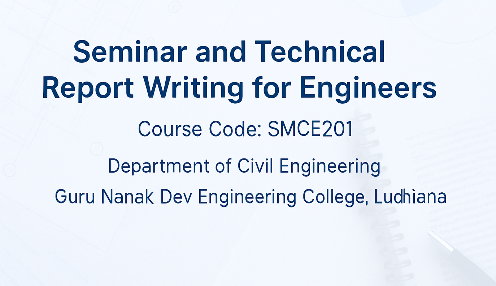

# Seminar and Technical Report Writing for Engineers

| **[Home](README.md)** | **[Syllabus](Contents/Syllabus.md)** | **[Guidelines](Contents/Guidelines.md)** | **[Submit Final Topic](Contents/final-topic-submission.md)** | **[Weekly Progress](Contents/Weekly_2025.md)** | **[Submissions](Contents/Submissions_2025.md)** | **[Contact](Contents/Contact.md)** |  

📢 Be ready with your short introductory presentations starting Monday, August 25, 2025. Presentations will be conducted during Week 4 (August 25–29, 2025) - [Click Here for more details](https://gndec-yjs.github.io/SMCE/Contents/Short_Presentation_Guidelines.html)
  

🚨 Submit your finalized approved topic by August 22, 2025 (Friday) - [Click Here](https://gndec-yjs.github.io/SMCE/Contents/final-topic-submission.html)

  

  [All Notifications](Contents/Notifications.md)

---

*Disclaimer: All rights and credits reserved to the respective owner(s) of the uploaded content/images. The uploaded content is solely for educational purpose. If you are the main copyright owner, contact to claim credit or content removal.*

---

